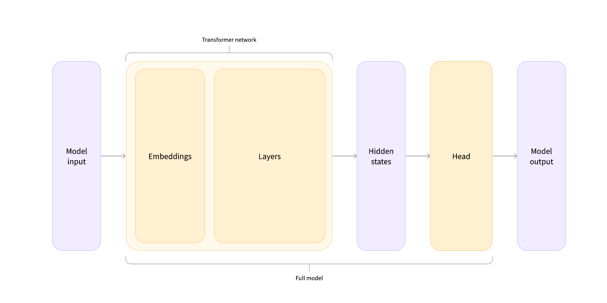

# Chapter2
## Pipeline的内部
1. iPad的内部有tokenizer还有Model一起组成
2. tokenizer负责转换成embedding，model负责输出结果
3. transformer库的所有model输出都是logits
4. 在执行model输出的时候，输出的结果会到hidden states。因此，如果需要执行下游任务，就不能使用普通的AutoModel，而应该使用相对应的：
```python
# 例如
from transformers import AutoModelForSequenceClassification

checkpoint = "distilbert-base-uncased-finetuned-sst-2-english"
model = AutoModelForSequenceClassification.from_pretrained(checkpoint)
outputs = model(**inputs)
```


## Model 模型
### 创建Transformer Config 对象
config可以用来声明模型的参数，例如隐藏层数，hidden layer size等
```python
BertConfig {
  [...]
  "hidden_size": 768,
  "intermediate_size": 3072,
  "max_position_embeddings": 512,
  "num_attention_heads": 12,
  "num_hidden_layers": 12,
  [...]
}

from transformers import BertConfig, BertModel

config = BertConfig()
model = BertModel(config)
```
但是，这样加载出来的模型是全新未训练的
因此，大多数时候我们通过加载预训练模型可以得到别人训练好的参数以及config

通过`model.save_pretrained()` 我们可以把训练好的模型保存。
```
ls directory_on_my_computer
config.json pytorch_model.bin`
```
config.json就是前面训练使用的config参数

## Tokenizer
1. 基于单词，考虑到情况太多了，显然不是很好
2. 基于字符。有些时候会吧单词，空格，划分的缺乏语义
3. 基于subword，单词的前缀后缀的组合划分，综合两者的优点
4. 其他

Tokenizer的加载和保存跟model是类似的。如果是字节使用checkpoint，可以使用AutoTokenizer

### Convert to tokens
```python
from transformers import AutoTokenizer

tokenizer = AutoTokenizer.from_pretrained("bert-base-cased")

sequence = "Using a Transformer network is simple"
tokens = tokenizer.tokenize(sequence)

print(tokens)
# ['Using', 'a', 'transform', '##er', 'network', 'is', 'simple']
```
通过这样的方式可以输出一个token列表，表示分词之后的结果再通过`ids = tokenizer.convert_tokens_to_ids(tokens)`将token转成数字

